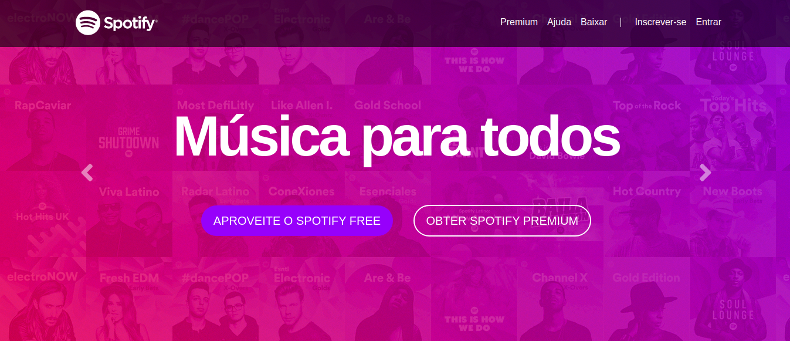

# Clonando a landing page do Spotify usando Bootstrap 4

  

  

  Projeto desenvolvido durante o curso ** Desenvolvimento Web Completo 2020 ** feita pela plataforma udemy
   
  Link: https://www.udemy.com/course/web-completo/

